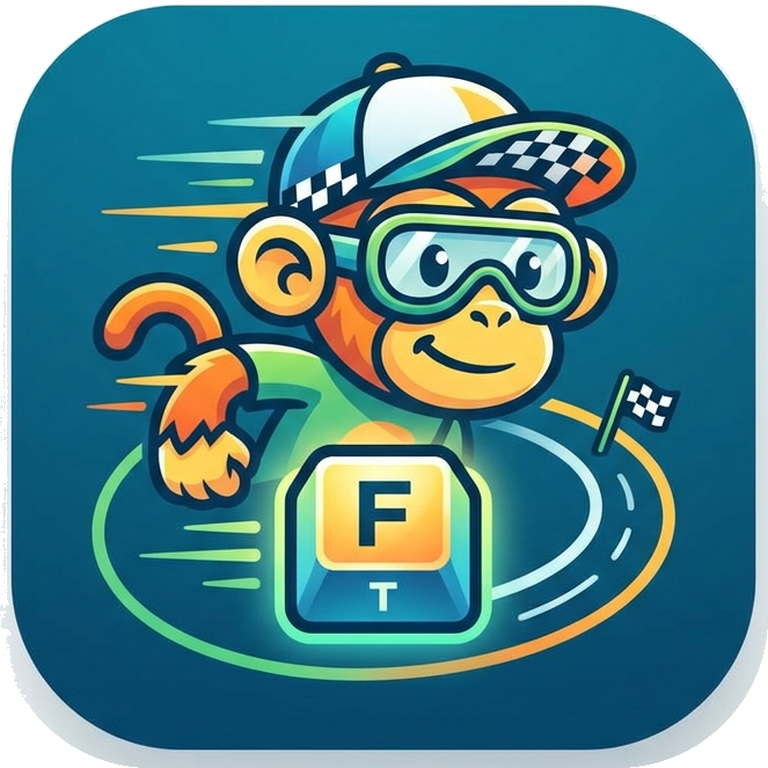

<p align="center">
  
</p>

# Frank Type

Frank Type is a Rails 8 typing trainer for practicing on normalized public-domain prose instead of random word lists. It is built for local-first, no-account use: session history, timing data, and profile charts stay in the browser's local storage.

## Highlights

- Rails-rendered UI with Hotwire, Stimulus, Importmap, and Tailwind CSS.
- Public-domain corpus organized for multiple languages: `config/excerpts/<language>/<category>/<speed>.yml`.
- English seed categories: `scifi`, `fantasy`, and `biography`.
- Adaptive excerpt choice based on recent local WPM:
  - `slow`: sub-60 WPM
  - `medium`: roughly 75–119 WPM
  - `fast`: 120+ WPM
- Category toggle with random fallback.
- Timed sessions: 15s, 30s, and 60s.
- Accurate browser-side key timing via `performance.now()`.
- Per-session metrics: WPM, raw WPM, accuracy, mistakes, character timings, word timings, key events, and digraph timings.
- Post-run digraph heat map: slow adjacent character pairs are highlighted after the timer ends.
- Typeracer-style race strip with simulated slower/faster competitors.
- Local profile page with WPM and accuracy trends.
- Docker Compose production-style deployment.

## Keyboard controls

| Key | Action |
| --- | --- |
| `?` | Open shortcut help |
| `Esc` | Restart current run; closes help if help is open |
| `Tab` | Load a random compatible excerpt |

## Development

```bash
bin/setup
bin/dev
```

Open <http://localhost:3000>.

## Tests

```bash
bin/rails test
npm test
bin/rails tailwindcss:build
```

`bin/ci` also runs RuboCop, Brakeman, bundler-audit, and importmap audit.

## Corpus notes

Project Gutenberg is the canonical source. Do not scrape its human-facing pages. Future importers should use official feeds, robot harvest URLs, rsync mirrors, or Gutendex metadata, then store title, author, ebook id, source URL, copyright flag, and attribution with every excerpt.

Current seed excerpts include public-domain Asimov stories available on Gutenberg plus AI/automation-adjacent classics such as _R.U.R._, _Metropolis_, and _The Machine Stops_. Famous Asimov works such as _Foundation_ and _I, Robot_ are not public-domain Gutenberg texts.

Target corpus size is at least 10 vetted excerpts per language/category/speed band.

## Docker

Local production-style container:

```bash
docker compose up --build
```

Then open <http://localhost:3200>.

Build and push the Docker Hub image when ready:

```bash
docker build -t akitaonrails/frank_type:latest .
docker push akitaonrails/frank_type:latest
```

## Homeserver deploy

This follows the `frank_mega` compose pattern:

1. Build/push `akitaonrails/frank_type:latest`.
2. Copy `docker-compose.prod.yml` and a real `.env.production` to the homeserver.
3. Create `/var/opt/docker/frank_type/storage` on the host.
4. Run:

```bash
docker compose -f docker-compose.prod.yml pull
docker compose -f docker-compose.prod.yml up -d
```

The container exposes Rails through Thruster on host port `3200`.
